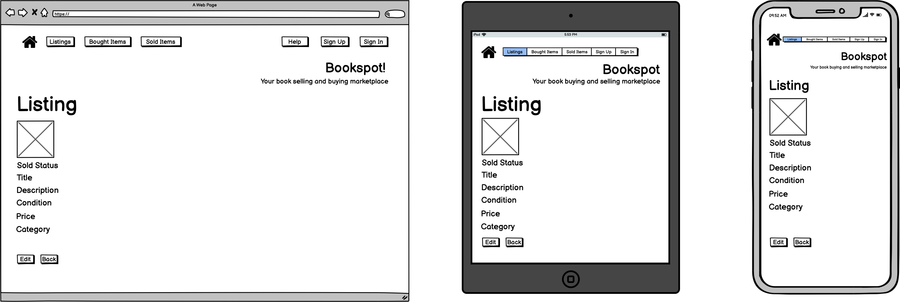
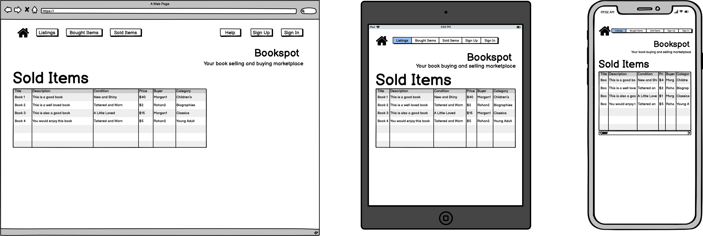

# READ ME
# Book Marketplace App Documentation 

## Scope

The Bookspot marketplace app has been created to solve the issue of not having a dedicated platform to buy and sell books. Whilst new books can be purchased at many stores and online, secondhand bookstores currently exist primarily in physical form. They provide a valuable service, but the amount given back to the seller is reduced by the margin needed for the store to make a profit. Also, given the nature of the product, each item is considered unique and requires inspecting the physical store to determine stock levels. Many people purchase a book to read once, either to continue a series or book club commitment, but then have it take up space in a bookshelf. Platforms such as eBay or Depop do allow for posting items such as books, but don’t cater specifically to the reading community. 

With the rise of reading throughout the pandemic, a dedicated and well designed platform will serve the needs of this community and provide a better secondhand resell service. It serves several needs, namely:
- Giving young readers a more affordable avenue for purchasing popular titles
- Contributing to a circular economy
- Providing book owners with a way to get a better return on books
- Online stock levels for unique items, reducing the need to travel to a physical store, or even multiple, which can deter readers

## Link to Deployed Site
https://bookspot-marketplace.herokuapp.com/

## Link to GitHub repository
https://github.com/MorganRohan/MorganRohan_T2A2 

## Bookspot Marketplace App Overview
### Purpose:
As outlined in the scope, the Bookspot marketplace app has been created to fulfil the needs of the reading community, namely a better option for buying and selling books. Users will be able to browse the site and listings, but will be able to create an account to list items for sale or purchase from other sellers. It is designed to better reflect and serve the demographic of the current reading community. 

### Functionality and features:
**View Listings**: 
Ability to view listings regardless of whether the user has a profile or is signed in. There will be a listing table, displaying all valid listings along with data about that listing, along with a show link to see it in a full page. When viewing the full page listing, the user will be able to view the image attached to the listing. 

**Create a User Profile**: 
User will have the ability to create a profile that has a username and password to log in and authenticate. 

**Sign Into Profile**: 
In a new session, the user will be able to sign into an existing account. If they have forgotten their password, there will be a "Forgot password?" link. 

**Create a Listing**: 
Once signed in, a user can then create a new listing for a product. The listing will have the option of uploading an image, adding a book title, book author, product description, product condition, price, genre and upload an image. 

**Edit and Delete Listings**: 
Access additional functions for listings created by the user. User will only have the option to edit or destroy a listing if they are signed in and are the original author of the listing. When editing the listing, they will be presented with the same style of form as when creating a new listing i.e. they will be abel to edit all attributes of the listing including uploading a new image. 

**Purchase a Listing**: 
Underneath the image displayed at the top of the listing will be a message that shows whether an item is available to purchase. If the user wants to purchase the item, they will need to sign up or sign in to an existing account. Once signed in and if the item is available to purchase, there will be a button under the image, which will redirect to a successful purchase page and show up in the "Sold Items" table for that user. 

**Access to Guide to create an effective Listing**: 
The app will have a help page that includes links to resources such as suggestions on how to create an effective listing. An effective listing can help make an item easier to find in a search, give more information to potential buyers and give guidance if the seller has never made a listing before. 

**Search Listed Titles**: 
A user, signed in or not, will be able to use the search bar function to search listed items by either the book title or author. Will present a list of the found items, which are clickable links to take the user directly to the listing. 

### Sitemap:

### Target Audience:

The reading community at large, ranging from the casual to the more dedicated, as well as the more casual user wanting to fetch a fair price for unwanted clutter. Social media, particularly TikTok, has led to a rise in younger readers who are familiar with apps and often prefer to use them. 

### User Stories

User Stories are an integral part of development, as they provide a short and simple description from the perspective of a user needing to use the functionality. These are the initial stories to test against as part of the initial testing process to ensure that the app in development is aligning with the original objectives. 

**Casual User**

- As a casual user, I want to be able to view the listings details without having to create an account.

- As a casual user, I want to be able to see the the sold status of a listing and create an account if I want to buy it. 

- As a casual user, I want to be able to access a help page and get more information about the application before creating an account. 

- As a casual user, I want to be able to search the titles of listed items and return a list of links to matching listed items.

- As a casual user, I want to be able to search the authors of listed items and return a list of links to matching listed items. 

**Authenticated User**

- As an authenticated user, I want to be able to sign into a single account and never buy or sell items with it.

- As an authenticated user, I want to be able to sign into a single account and be able to buy or sell with the same details. 

- As a seller, I want to be able to create a new listing and specify the details of the product.

- As a seller, I want to be able to sign into my account and list any number of items for sale. 

- As a seller, I want to be able to sign into my account and view my sold items. 

- As a seller, I want to be able to access a help page and get more information about the application.

- As a seller, I want to be able to sign into a single account and also be able to purchase listed items. 

- As a seller, I want to be able to sign into my account and edit the details of my listings.

- As a buyer, I want to be able to easily create an account to purchase items.

- As a buyer, I want to be able to sign into my account and view my bought items. 

- As a buyer, I want to be able to sign into a single account and also be able to list items for sale. 

- As a buyer, I want to be able to sign into my account and buy any number of available items. 

### Tech Stack:
- Programming Languages
    - Ruby on Rails
    - JavaScript

- Frontend Framework
    - Skeleton CSS Boilerplate
    - HTML
    - CSS and SCSS

- Database
    - PostgreSQL

- Deployment Platform
    - Heroku

## Wireframes
Wireframes are used to create a layout and determine the styling of a page, as well as how it will look across different screen sizes and formats. They are used as part of the planning process, so that a developer has a clear idea of the format before starting to code. 

### Home Page Wireframe

### View Listings Page Wireframe

### Sign Up Page Wireframe

### Sign In Page Wireframe

### Create Listing Page Wireframe

### Example Listing Wireframe

### Sold Listings Page Wireframe

### Bought Listings Page Wireframe

### Help Page Wireframe

### Listings Guide Page Wireframe

### Sitemap Page Wireframe

## ERD

Initial planning ERD representing relationships

ERD generated from Rails ERD gem to represent built app database

Finalised ERD as a composite of the above two diagrams, providing a comprehensive diagram of the final app design and function.

## High Level Components

As is commonly used in applications built using Ruby on Rails, this marketplace application was built utilising the MVC architecture. Throughout the design and planning process, it was identified how the different features of the application would be represented and handled by the models and controllers, applying the DRY principle to query the database in an efficient manner. The ERD provided in the previous section provides information on the how the tables in the database were structured, along with the models and controllers required to function. 

This section will focus on the latter, explaining how models, controllers and also views were chosen, along with the impact of inheritance. Inheritance is used throughout the models and controllers, facilitating table inheritance and code reuse. 

**Models**

At the core of the application was the Application Record model, which inherited from the Active Record Base. This will be discussed in more detail in a later section.

There were 3 main functions identified for the app: 
1. User account creation and access (authentication and authorisation logic)
2. Item listing creation, viewing, editing and deletion (CRUD functions)
3. Ability to purchase an item in an order
Each of these are represented by models - Account, Listing and Order - and inherit from the Application Record Model, meaning that they also inherit the Active Record. An additional model was created to handle the Category table. 

**Controllers**

Following MVC convention, controllers were generated to reflect how the different user functions would interact with the data in the models of the database. As with the models, an application controller exists, inheriting directly from the Action Controller Base. Controllers were also create to handle the queries related to Listings, Orders, Pages and the Search function. Note that the Devise gem was utilised to handle most of the Accounts functions, eliminating the need to create a separate Accounts controller, instead appearing as a before_action within the Application Controller. 

The Listings controller handled the create, read, update and destroy methods needed for the functionality of the listings. It inherits from the Application Controller, as do all of the other controllers, allowing for the continuation of the account authentication. This eliminates the need for repeated authentication queries and less database calls. 

The Orders controlller simply handled the methods pertaining to allowing an authenticated user to purchase an item, as well as view their previously bought and sold items. Also inherits from the Application Controller. 

The Pages controller contains simple methods to view the pages as required. The app has a simple structure, so all of the functions are viewed and access from a singular home page. Also inherits from the Application Controller.

The Search controller performs the one function of querying the data stored to return a result. This function needs a controller and not its own model as it is querying whether data exists and doesn't require its own storage. Also inherits from the Application Controller. 

**Views**

Through the generation of the Models and Controllers above, certain views were created by Rails. The names of these align with the methods specified within the controllers and render the interfaces neeeded for the user to access the functions. Naming convention and the reusable logic of the controllers helps to reduce the overall queries of the database. 

## Third Party Services 
**Devise Gem**

Installed and used to handle the authentication functions of the app, primarily sign up, sign in and sign out. Devise is a very popular and useful gem, since it is flexible and works very well in the Rails MVC architecture. It's a comprehensive authentication tool and essentially does a lot of the hard work for the developer, saving time and reducing the chance of developer error. 

Installation of Devise includes the html.erb files detailed in the "devise" folder, in the views folder of the source code. These are the views for the different functions for account management, including creation and password reset. It also allows Devise to be used in the Account Model. 
Link: https://rubydoc.info/github/heartcombo/devise 

**RSPEC Gem**

Installed and used run tests on the application code, the RSPEC for Rails gem is widely used to assist with the behaviour driven development process. The spec folder is generated by the install of the gem and includes a wide range of lightweight tests to be run based on the generated models and controllers. It runs a number of generic scenarios using the methods and relations established by the developer. 

Link: https://rspec.info/ 

**Rails ERD Gem**

Installed and used to compare developed app with planned structure to present final ERD representative of actual application. This gem was used in order to provide a more accurate representation of the final application and provides comparison for actual vs theoretical. Whilst care was taken during the planning process to develop an accurate and comprehensive ERD, comparison shows that the Active Storage and Action Text weren't properly considered or represented. Therefore, the gem provided a useful tool to update a final and comprehensive diagram. 

Link: https://github.com/voormedia/rails-erd 

**Heroku**

Heroku is the chosen deployment and hosting platform for the application. It is a cloud-based Platform as a Service and was listed as the recommended deployment platform for this project. Of particular note is the ability to utilise the pipeline development, which deploys a staging app before being available to push to production. This is well suited to the Git workflow of choice, as it was set up to auto-deploy from the development branch of the repository. Once in production, the application is live and hosted by Heroku, shareable by link to all users. 

Link: https://www.heroku.com/about#:~:text=What%20is%20Heroku%3F,getting%20their%20apps%20to%20market. 

**Ransack Gem**

Installed and used to help implement the search bar function, the Ransack gem is a widely popular Rails gem. It is the successor to the MetaSearch gem. Able to be used for simple or advanced search forms and can be easily implemented into an established Rails app with little setup effort. For this app, the simple mode was used, requiring only a few lines of code in the Controller and View. This gem was utilised for a similar reason as Devise; whilst this logic and code can be established manually by a developer, this gem works well within Rails and is designed to help reduce developer error. 

Link: https://www.rubydoc.info/gems/ransack/1.7.0

## Model Relationships

"Active Record facilitates the creation and use of business objects whose data requires persistent storage to a database."((Active Record Basics — Ruby on Rails Guides, 2022). Put simply, it allows for the Object Relational Mapping system, which means the properties or relationships of an object are more easily stored and retrieved, reducing the need to directly write SQL statements explicitly. Between the use of the MVC architecture and PostgreSQL database management system, the Bookspot app employs an Object Relational Database system. This allows for supporting objects, along with their classes and inheritance, as well handling queries to the data base. Essentially, it allows for a more complex structure, but using PostgreSQL makes it easier to implement the designed Models, Views and Controllers.

The models used in the design of this app have been previously discussed and include one each for Application Record, Account, Listing, Order and Category. In this application, the Active Record Base is inherited to the Application Record Model, which in turn is inherited into the other models. We then have the Active Record associations that connect the Active Record models, which can be used in this design because of inheritance.

Active Record associations can be declared between the models in order to more effectively call and reuse data, without unnecessary duplication of data. Specifically looking at Bookspot, there are two key areas where this particularly has the most impact, but it is implemented throughout the design. The Listings and Accounts models make the most use of these associations, but we will be discussing the associations in all the models. 

**Application Record**
Is an abstract class and is primarily used for the inheritance properties, does not have a table of data associated with it. 

**Account**
- has_many listings
- has_many sold orders 
- has_many bought_orders
These associations allow for a user to have a single account which can then have one or many listings, one or many sold orders and one or many bought orders. It essentially represents that one instance of the Account model can have zero or more instances of the other models.  

**Listing**
- belongs_to account
- belongs_to category
These associations declare that a created listing belongs to an account and also belongs to a category. The belongs_to association connects the two models so that each instance of the listing belongs to an instance of the other model. In this case, the account_id or category_id are assigned as Foreign Keys within the Listing model, which directly references the Primary Key within that model.  

**Order**
- belongs_to listing
- belongs_to buyer
- belongs_to seller
These associations show how an order belongs to a listing, belongs to a buyer and belongs to a seller. Essentially, an order only exists based on the data from each of the table associated with the Listing and Account models. In this case, the listing_id, buyer_id  and seller_id are assigned as Foreign Keys within the Order model, which directly reference the Primary Key of the Model they belong to. Logic within the Account model establishes that a single account_id can be used as either the buyer_id or seller_id where relevant. 

**Category**
Is only associated to the Listing model by "belongs_to".

## Database Relations

The Bookspot application has been designed using an Object Relational Database model, part of which obviously includes using a Relational Database Design (RDD). RDD uses tables to organise the data, then relationships are defined between the tables by the use of Primary and Foreign Keys. For the Bookspot application design, it was first identified the different entities to be represented and then the attributes of each were assigned. Going back to the intial ERD for this application, the first tables to be declared were the Account, Listing and Order tables. The attributes were then determined based on the data needed to make each entity meaningful.

From the ERD: 
**Listings**

- PK: listing_id
- title
- author
- description
- condition
- price
- sold
- FK: account_id
- FK: category_id
- FK: image

**Accounts**

- PK: account_id
- email
- username
- password

**Orders**

- PK: order_id
- FK: listing_id
- FK: buyer_id
- FK: seller_id

The primary key of each table is the unique id number given to each entity, they can then be used as a Foreign Key in another table for the purpose of creating the relationship. The Primary Key of a table can only be used if it is unique and not left blank. For example, the email of an account wouldn't be used as the Primary Key because it is possible that two different users could have the same email address. In the ERD for the Bookspot application and the list above, it can be seen that the Listings table can be related to the Accounts table by a "one-to-many" relation, since one account can have many listings. The Primary Key account_id from the Accounts table is then referenced in the Listings table as a Foreign Key. The Listings table also has a "one-to-one" relation with the Category and Active Storage tables, through the respective Foreign Keys.

The Orders table has a unique id for each order generated, but the data within the table is accessed through Foreign Key relations. The information about the item purchased is accessed through the "one-to-one" relation, referenced by the Foreign Key listing_id. Similarly, it has an "one-to-one" relation with the seller account by referencing the Foreign Key seller_id and a "one-to-one" relation with the buyer account by referencing the Foreign Key buyer_id.

## Database Schema

Similar to the planned and finalised ERD, below schema shows the design for the database. Whilst an ERD also provides information on the associations and relations between the data tables, the schema below is a more simplified version showing the database model. 

## Implementation Plan

The book marketplace app has been planned and the implementation plan developed primarily using a Trello board to track and manage tasks. 

Link to Trello Board: https://trello.com/b/t9rMOjaB/marketplace-app 

Here is an example of the board after the first sprint (two week period) working on the marketplace project. 

Here is an example of a tile used to plan and track the implementation of a feature. It describes the feature to be implemented, a due date for that feature and a checklist of tasks breaking down the steps. In a larger application project, members could easily be added to the tiles as tasks are assigned. Labels were also created and assigned to each of the tiles, to quickly describe the importance of a task, whether it's part of the planning or development process, as well as whether it relates to a function or the styling. 

An overall planning tile was used as a more macro view of the project and primarily to satisfy the documentation requirements of the project. 

A specific style of Git workflow was chosen in order to effectively manage the development and deployment of the application. 

The chosen platform for deployment was Heroku, with an approach of deploying early and then deploying updates often. The pipeline feature of Heroku was used in order to have a staging app to test the functionality before pushing to production. 

As linked at the beginning of this document, a Github depository was established early to manage all the changes to the code and commits were made frequently to minimise data loss. 

## Bibliography

Ruby on Rails Guides. 2022. Active Record Associations — Ruby on Rails Guides. [online] Available at: <https://guides.rubyonrails.org/association_basics.html#belongs-to-association-reference> [Accessed 8 July 2022].

Ruby on Rails Guides. 2022. Active Record Basics — Ruby on Rails Guides. [online] Available at: <https://guides.rubyonrails.org/active_record_basics.html> [Accessed 8 July 2022].

Techopedia.com. 2017. What is Relational Database Design (RDD)? - Definition from Techopedia. [online] Available at: <https://www.techopedia.com/definition/25113/relational-database-design-rdd> [Accessed 3 July 2022].
